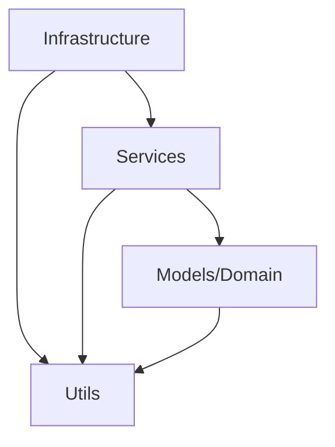

# Arquitetura do Projeto POC-TIS6

Este documento descreve a arquitetura do sistema de coleta e análise de dados de Pull Requests (PRs) do GitHub, implementado seguindo os princípios da **Clean Architecture** e **SOLID**. O objetivo é fornecer um guia para desenvolvedores e pesquisadores sobre a estrutura lógica do projeto, responsabilidades de cada camada e diretrizes para contribuições.

## 1. Visão Geral da Arquitetura

O sistema implementa um pipeline de dados em 6 fases para analisar dinâmicas de revisão de PRs em repositórios GitHub:

1. **Discovery (Descoberta):** Coleta repositórios-alvo com base em critérios de linguagem, estrelas e contribuidores.
2. **Extraction (Extração):** Extrai PRs mesclados e interações (revisões, comentários) via GraphQL API.
3. **Sanitization (Sanitização):** Limpa dados inválidos, remove anomalias e filtra repositórios com baixa atividade.
4. **Modeling (Modelagem):** Constrói grafos de rede para calcular métricas de centralidade (degree, betweenness).
5. **Analytics (Análises):** Executa testes estatísticos para responder questões de pesquisa (RQs).
6. **Reporting (Relatórios):** Gera visualizações e tabelas para publicação.

O fluxo de dados segue uma arquitetura em camadas, com separação clara entre infraestrutura, serviços, domínio e utilitários, garantindo testabilidade, manutenibilidade e extensibilidade.

## 2. Mapeamento de Responsabilidades (Camadas)

### Infrastructure (`src/infrastructure/`)

Responsável pela comunicação com sistemas externos (GitHub API), abstraindo detalhes de transporte via **Dependency Inversion Principle (DIP)**.

- **Factories (`factories/`):** `EnvironmentResolver` detecta automaticamente o transporte disponível (HTTP via token ou CLI). `RepositoryFetcherFactory` instancia fetchers dinamicamente.
- **Fetchers (`fetchers/`):** Implementações concretas de `RepositoryFetcher` (interface em `contract/repository_fetcher.py`):
  - `HttpRepositoryFetcher`: Usa `requests` com backoff exponencial.
  - `CliRepositoryFetcher`: Envolve o comando `gh` via subprocess.
  - `BaseRepositoryFetcher`: Template Method para paginação e retry comum.
- **GraphQL (`graphql/`):** `GraphQLClient` orquestra execuções GraphQL de forma transport-agnostic, injetando o fetcher selecionado.

### Services (`src/services/`)

Camada de orquestração que coordena o pipeline, injetando dependências e delegando lógica de negócio. Não guarda regras rígidas de domínio (**Single Responsibility Principle - SRP**).

- `RepositoryManager`: Coordena Fase 1, lê configuração centralizada e distribui para fetcher.
- `ReviewDataExtractor`: Orquestra Fase 2, processa nós GraphQL, calcula latências e enriquece com perfis de experiência (cacheado).
- `DataCleaner`: Fase 3, aplica regras de limpeza (ex.: mínimo de PRs por repositório).
- `GraphModeler`: Fase 4, constrói grafos NetworkX e calcula centralidade.
- `StatisticalAnalyzer`: Fase 5, executa estratégias de análise (padrão Strategy).
- `DataVisualizer`: Fase 6, gera plots e tabelas.

### Models / Domain (`src/models/`)

Isola regras de negócio e heurísticas científicas, retornando objetos de domínio imutáveis.

- `ExperienceClassifier`: Classifica experiência de desenvolvedores com base em PRs históricos, taxa de aceitação e revisões formais.
- `ExperienceProfile`: Data Class representando perfil de experiência (prior_prs, acceptance_rate, formal_reviews, category).

### Strategies (`src/services/strategies/`)

Isola questões de pesquisa (RQs) utilizando o padrão **Strategy**, permitindo extensibilidade sem modificar o analisador.

- `AbstractAnalysisStrategy`: Contrato abstrato para estratégias.
- `RQ1Strategy`: Analisa impacto da centralidade na latência de revisão.
- `RQ2Strategy`: Moderação por experiência (novatos vs. experientes).
- `RQ3Strategy`: Efeito da assimetria de centralidade na latência.

### Utils (`src/utils/`)

Concerne transversais de suporte, organizados em pastas especializadas.

- **config (`config/`):** `ConfigManager` (Singleton) centraliza configuração YAML.
- **data (`data/`):** `DataExporter` para I/O de CSV/JSON; `stats_utils` para cálculos estatísticos.
- **filters (`filters/`):** `github_filters` para filtrar humanos vs. bots.
- **output (`output/`):** `OutputFormatter` para exibição de progresso.
- **time (`time/`):** `time_utils` para cálculos de latência (horas úteis, tempo até merge).

## 3. Padrões de Projeto e Boas Práticas Identificadas

### Padrões Implementados
- **Factory Pattern:** Para criação dinâmica de fetchers.
- **Strategy Pattern:** Para análises RQs plugáveis.
- **Template Method:** Em `BaseRepositoryFetcher` para lógica comum de paginação.
- **Dependency Injection:** Em todos os serviços, dependem de abstrações (ex.: `RepositoryFetcher`).
- **Singleton:** Para `ConfigManager`.
- **Adapter:** `GraphQLClient` como adaptador transport-agnostic.
- **Plugin Auto-Registry:** Fetchers se registram automaticamente via `__init_subclass__`.

### Princípios SOLID
- **SRP:** Cada classe tem uma responsabilidade única (ex.: `ExperienceClassifier` só classifica).
- **OCP:** Extensível sem modificação (novos fetchers/estratégias adicionam sem alterar fábricas/analisadores).
- **LSP:** Implementações de `RepositoryFetcher` são intercambiáveis.
- **ISP:** Interfaces mínimas (ex.: `AbstractAnalysisStrategy` só define `execute`).
- **DIP:** Camadas superiores dependem de abstrações, não concretas.

### Diferença entre Responsabilidades
- **Orquestração (Services):** Coordena fluxo, injeta dependências, delega cálculos. Ex.: `ReviewDataExtractor` chama `calculate_business_hours_latency` mas não implementa a fórmula.
- **Cálculo/Regra (Models/Utils):** Contém lógica pura de negócio ou matemática. Ex.: `ExperienceClassifier.classify` encapsula heurísticas de classificação; `time_utils` calcula latências.

## 4. Guia Rápido de Contribuição

- **Onde coloco uma nova regra de negócio?** Em `src/models/`, criando uma nova classe ou método (ex.: novo classificador de risco). Se for heurística científica, isole em um módulo dedicado.
- **Onde adiciono uma nova requisição na API?** Em `src/infrastructure/graphql/`, atualize `pr_query.graphql` ou crie uma nova query. Para transporte, adicione em `fetchers/` se necessário.
- **Onde crio a análise estatística para a RQ4?** Em `src/services/strategies/`, crie `RQ4Strategy` herdando de `AbstractAnalysisStrategy`, implemente `execute(df)` com testes estatísticos, e registre no `StatisticalAnalyzer`.</content>
<parameter name="filePath">c:\Users\Joao\Documents\Faculdade\TIs\poc_01_05\poc_coleta_tis6\ARCHITECTURE.md